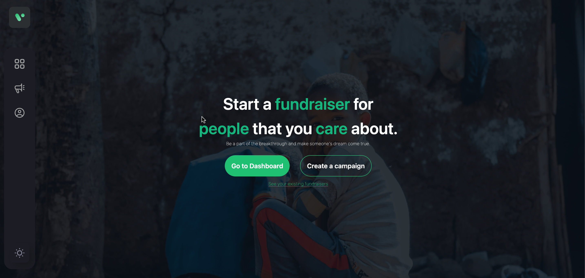
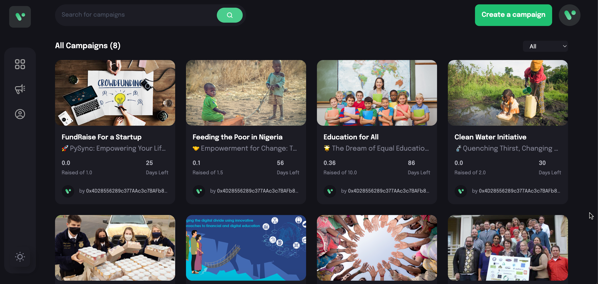
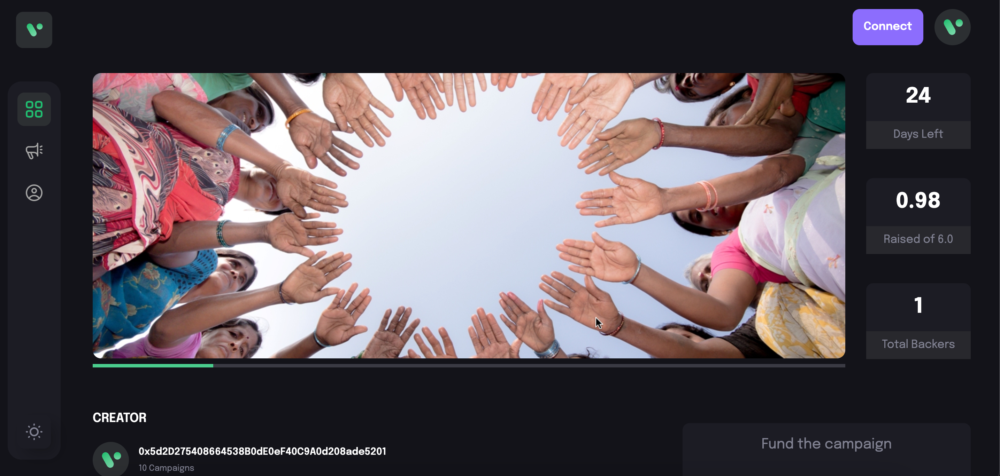
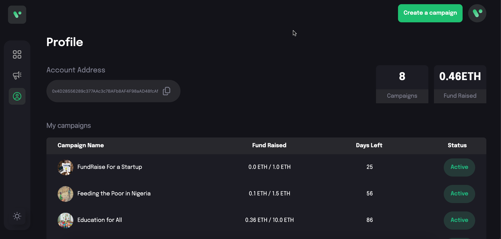

<h1>Blockchain Crowdfunding Platform</h1>

This Git repository hosts the code and resources for our final year project, a crowdfunding platform based on blockchain technology and smart contracts. The platform is built using React, providing a user-friendly interface for users to participate in crowdfunding campaigns securely and transparently.

The project members include Dawood Trumboo, Aqeel Beigh, and Shaker Khan, who have collaborated to develop this innovative solution. Under the guidance and supervision of Dr. Sahil Sholla, our esteemed project supervisor, we aim to create a reliable and decentralized crowdfunding platform.

<h5>Presentation</h5>
[Click Here](https://www.canva.com/design/DAFspDCcT88/y1RbsjuErD1dG9crcXJhpw/edit)  

<h2>Key Features:</h2>

- <b>**Blockchain Integration:** The platform leverages the power of blockchain technology to ensure transparency, immutability, and security for all crowdfunding transactions and interactions.</b>
- <b>**Smart Contracts:** Smart contracts are utilized to automate campaign management, secure funds, and distribute rewards to backers based on predefined conditions.</b>
- <b>**React Framework:** The frontend is developed using React, providing an intuitive and interactive user interface for seamless navigation and engagement.</b>
- <b>**Secure Fund Handling:** The platform ensures the secure handling and transfer of funds by leveraging blockchain's cryptographic features and decentralized infrastructure.</b>
- <b>**Campaign Tracking:** Users can easily track the progress of ongoing campaigns, view real-time updates, and monitor the utilization of funds.</b>

<h2> Project Images </h2>

* ## Landing Page:

* ## Dashboard:

* ## Campaign Form:

* ## Campaign Details:

* ## Profile:

  <h3>Project Members:<h3>

      Dawood Trumboo
      Aqeel Beigh
      Shakir Khan

  <h3>Project Supervisor:</h3>
  
      Dr. Sahil Sholla
